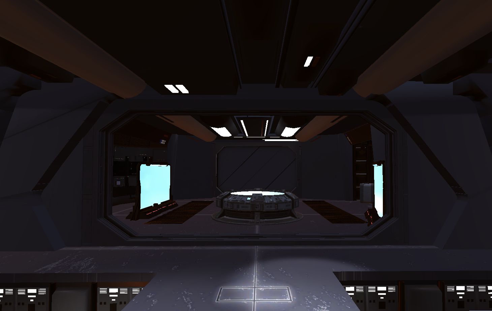
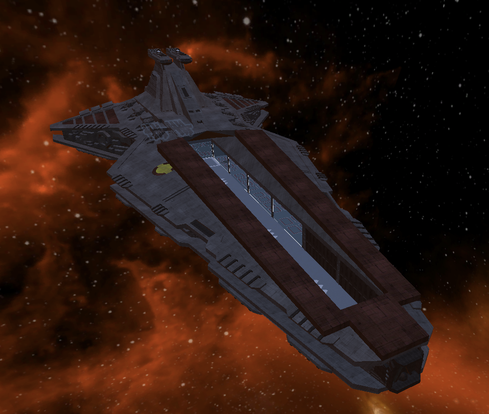
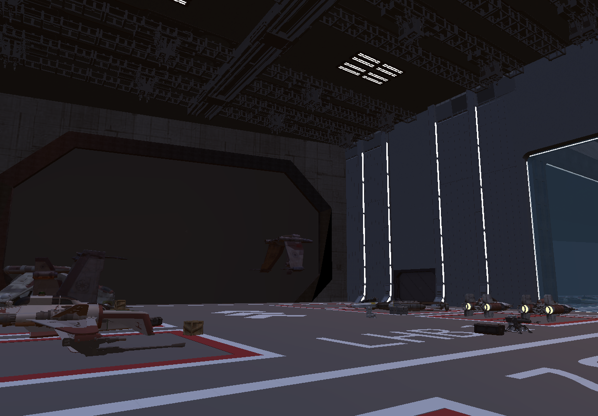
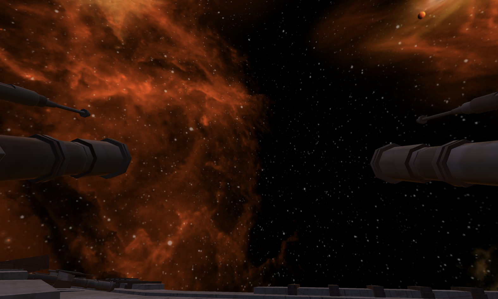
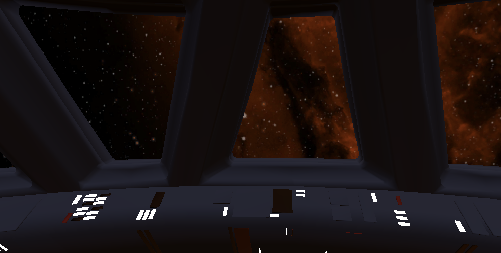

# Venator Simulator

*These screenshots come from the `Examples/` folder in this repository.*

---

## Overview

Venator Simulator is a Star Wars-inspired real-time strategy/tactics project currently in development. The player defends a **Venator-class Star Destroyer** against waves of droids and controls clone troopers either individually or as squad leaders.

Players can switch between frontline soldiers and the command bridge to issue orders to both individual units and entire squads. Each unit has only one life, can gain experience, be equipped, and receive unique names.

---

## Key Features

- Switchable control between individual soldiers and squad leaders (First-Person / Command View).  
- Real-time waves with increasing difficulty (air and ground combat).  
- Experience system: soldiers gain XP, die permanently (permadeath), and can be customized with weapons, skins, and stickers.  
- Missions & tasks: configurable objectives and waves via TaskManager/TaskDefinition.  
- Squad control: squad commands and RouteDefinition for AI pathfinding.  
- Interaction: doors, consoles, and switches via Interactable/ButtonScript/PlayerInteraction.  
- Environments: hangar scenario with gates and environmental objects.  
- Adjustable AI and weapon logic (SoldierController, GunControl, Shooting).  
- Performance: basic camera culling and optimization approaches.

---

## Technical Notes

- Recommended Unity version: 2022.3.7f1  
- C# Language Version: C# 9  
- Models needed: clone trooper 3D models (for playable units and enemies)
